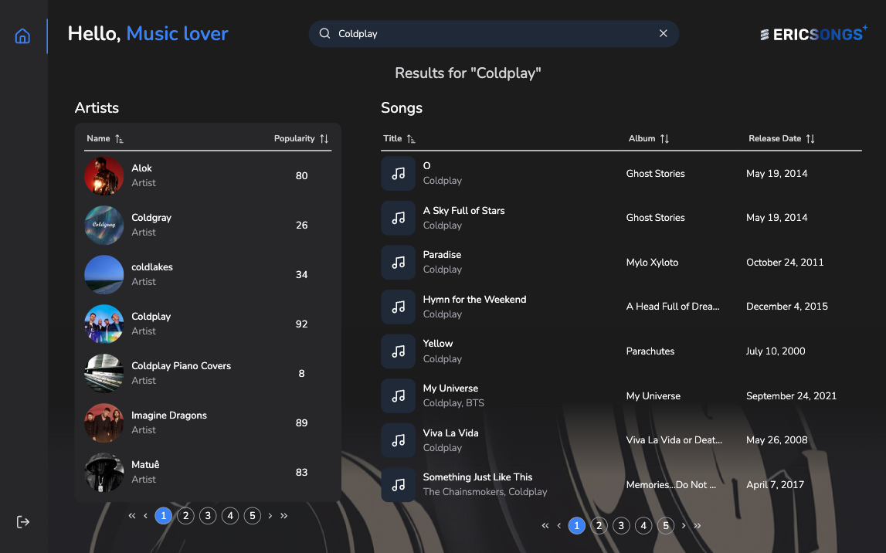

<p align="center">
    
</p>

<p align="center">
    
</p>

<p align="center">
  
</p>

<p align="center">
    
</p>

**Discover and search** your favorite songs and artists using **Ericsongs**. Unlock a world of top songs and artists with your Spotify account.

-   The project is deployed <a href="https://ericsongs.vercel.app/" target="_blank">here</a>.

> To get started, you need to create a Spotify account and log in with it. On the home page, you can search for artists and songs.

##

### Index

1. [About the project](#about)
2. [Features](#features)
3. [How to execute](#how-to-execute)
4. [Technologies](#technologies)
5. [Author](#author)
6. [License](#license)

##

<div id='about'></div>

### 1. About the project

This project is a single-page application for searching music artists and songs. It is built using _React, TypeScript, Tailwind, Redux and integration with the **Spotify API**_.

##

<div id='features'></div>

### 2. Features

-   [x] Login with Spotify API
-   [x] Search using Spotify API
-   [x] Search artists
-   [x] Search songs
-   [x] Results pagination
-   [x] Sort results
-   [x] Logout

##

<div id='how-to-execute'></div>

### 3. How to execute

1. Firstly, install the following tools:

    - <a href="https://git-scm.com" target="_blank">Git</a>
    - <a href="https://nodejs.org/en/" target="_blank">Node.js</a>

2. Clone this repository:

    ```
    $ git clone git@github.com:rafawessling/ericsongs.git
    ```

3. Access the project folder on the terminal/cmd:
    ```
    $ cd ericsongs
    ```
4. Install the dependencies:
    ```
    $ npm install
    ```
5. Set up Spotify Developer Account and Application:

    - Go to <a href="https://developer.spotify.com/dashboard/" target="_blank">Spotify Developer Dashboard</a> and log in (or create an account if you don’t have one).
    - After logging in, click on **Create an App** to set up a new application.
    - Fill in the required details, like the app name and description, and then click **Create**.
    - Once your app is created, go to the **Settings** tab and find the Client ID.
    - Under **Redirect URIs**, click **Add URI** and enter the following:

        ```
        http://localhost:5173/
        ```

6. Create your `.env` file:

    - Copy the `.env.example` file and rename it to `.env`:

        ```
        $ cp .env.example .env
        ```

    - Open the `.env` file and add your Spotify credentials:

        ```
        VITE_SPOTIFY_CLIENT_ID=your_spotify_client_id_here
        VITE_REDIRECT_URI=http://localhost:5173/
        ```

    - Replace **your_spotify_client_id_here** with the actual value from your **Spotify Developer Dashboard**.

7. Run the application:

    ```
    $ npm run dev
    ```

    The server will run on port: 5173 → Access: <a href="http://localhost:5173" target="_blank">http://localhost:5173</a>.

##

<div id='technologies'></div>

### 4. Technologies

These are the main technologies used in this project:

-   React
-   TypeScript
-   Redux
-   React Router
-   Tailwind
-   PrimeReact

##

<div id='author'></div>

### 5. Author

Developed by <a href="https://www.linkedin.com/in/rafaela-wessling/" target="_blank">Rafaela Wessling Oening</a>.

**How to contribute to the project:**

1. _Fork_ the project.
2. Create a _new branch_:
    ```
    $ git checkout -b my-feature
    ```
3. Save your changes and _commit_ them:
    ```
    $ git commit -m "feat: Added new feature"
    ```
4. _Submit your changes_:
    ```
    $ git push origin my-feature
    ```

##

<div id='license'></div>

### 6. License

This project is developed by <a href="https://www.linkedin.com/in/rafaela-wessling/" target="_blank">Rafaela Wessling Oening</a>. Reach out!

##

###### tags: `Frontend` `React` `typescript` `Redux` `React Router` `Tailwind`
